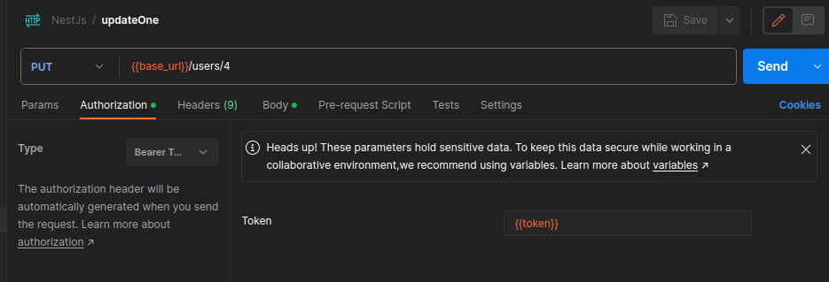

### NestjsTutorial

## Cambios en el docker para arrancar todo con un comando

#### La idea es lanzar un docker con un archivo de configuracion que infiera la configuracion a todas las maquinas.
---
Ahora mismo tenemos un comando para recompilar, solo es necesario si añadimos algun modulo que no estuviera(llama a Dockerfile, para ejecutar el npm install) 
`"docker:dvrb": "docker compose --env-file ./config/.env.dev up --build"`

Y el comando para levantarlo normalmente
`"docker:dv": "docker compose --env-file ./config/.env.dev up"`

---

### Configuracion de Postman para las variables

Primero definimos la variable:

Despues en el login la rellenamos con el token

Y ya a cada endpoint que necesitemos le asignamos el token
